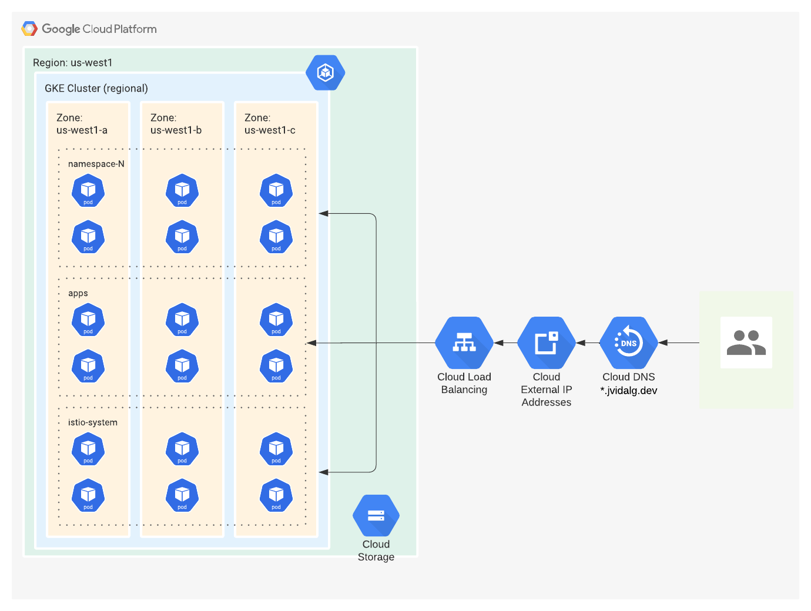
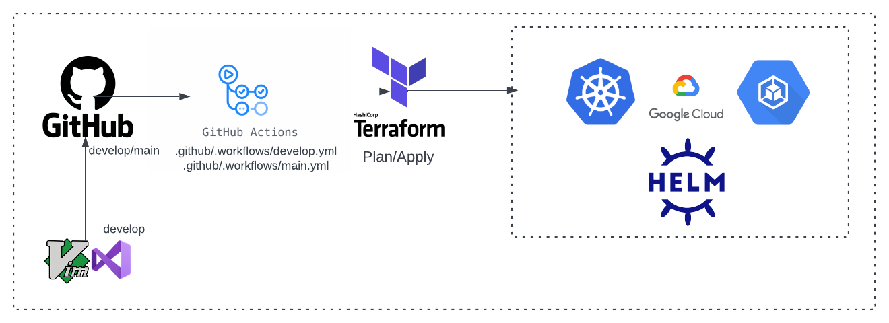
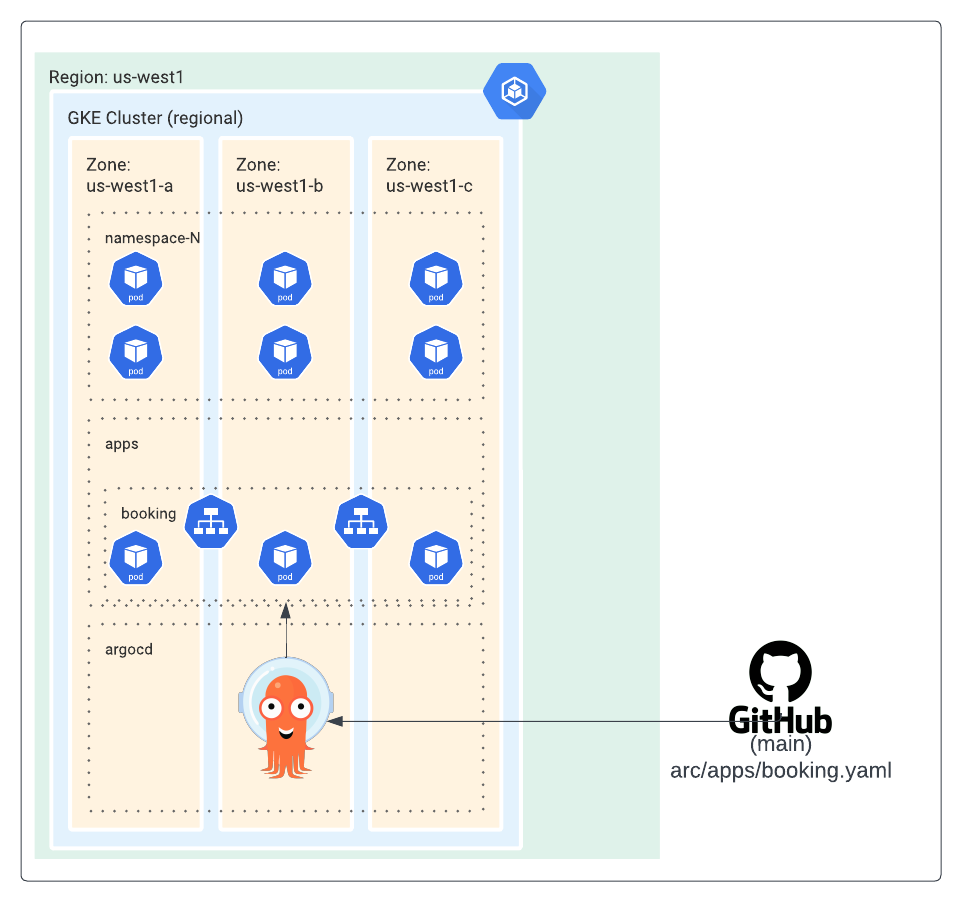
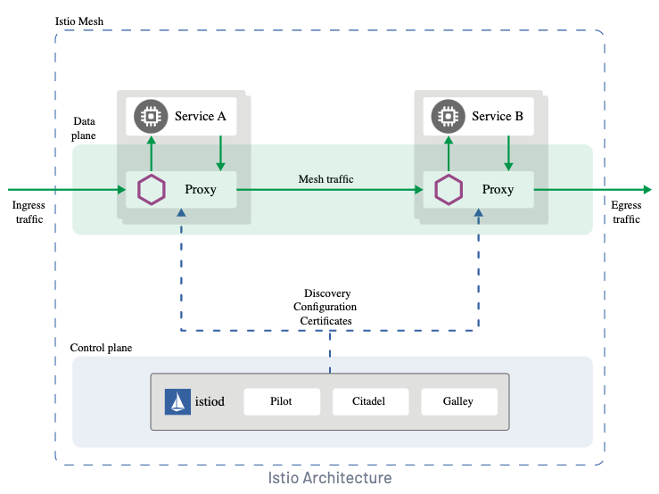
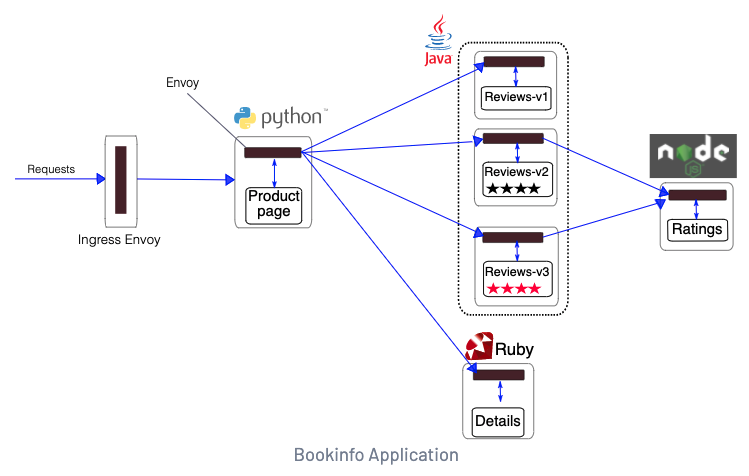

# GKE Demo

## Status
| Branch  | Status  |
|---|---|
| `main`   |   |
| `develop`  |   |

## Infrastructure

Regional cluster

- Control and Data plane High Availability
- Resilence from zone failure
- Continuous control plane upgrades
- Reduced downtime from control plane failures

## CICD

### Terraform

### Applications

Argocd is used for applications deployments to the GKE cluster. For this demo, we are using the raw kubernetes manifest files, but Argocd also supports other methods such as helm.

#### GitOps

## Service Mesh

- Secure cloud-native apps
- Manage traffic effectively
- Monitor service mesh
- Simplify load balancing with advanced features
- Enforce security
- End to end encryption

For this demo, [Booking](https://istio.io/latest/docs/examples/bookinfo/), the istio example, is used:

## Usage

### Requirements

- A GCP service account file that will be used as a GitHub Actions secret named `GKE_SA`, please 
- The GCP `project id` you will deploy to. Currently, the project has this value hardcoded at . If you desire to have mo flexibility, you can create a `datasource` or use other method to provide the value such as a `TF_VAR`

TODO some day

